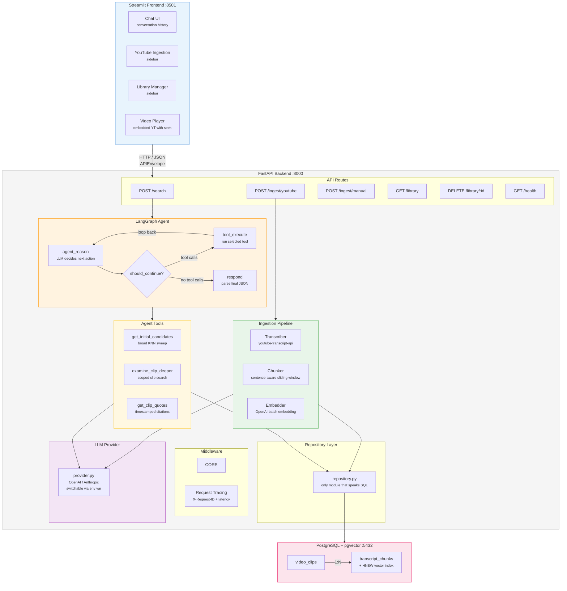
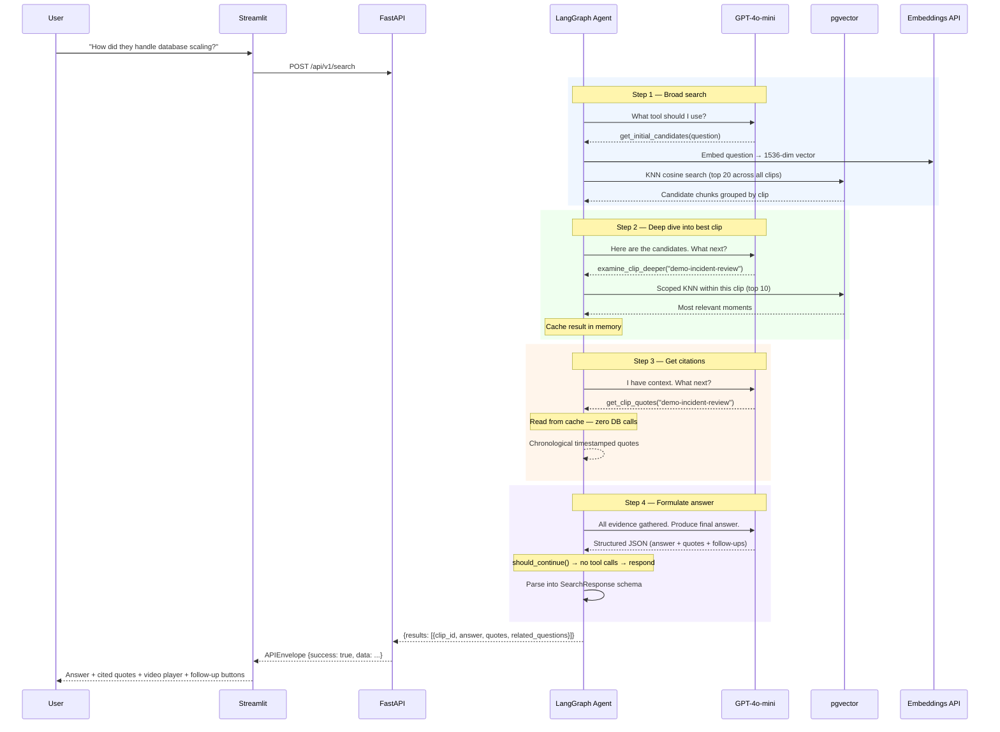
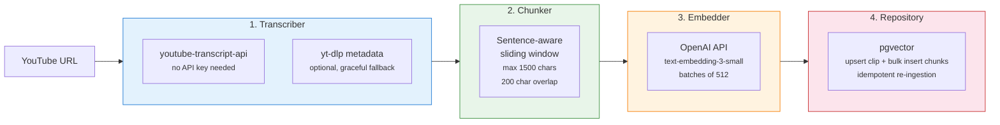
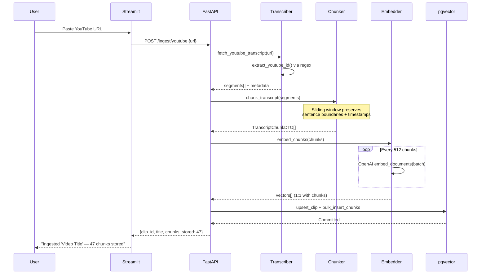
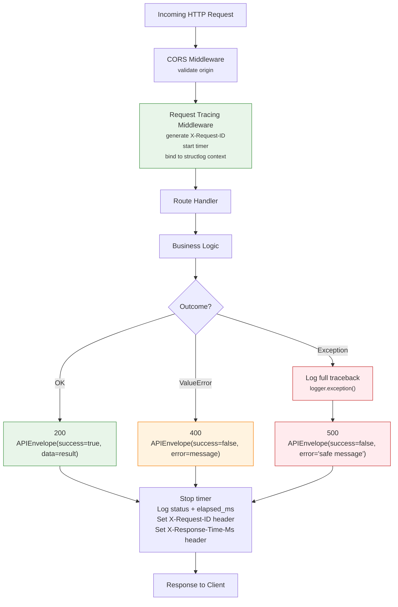
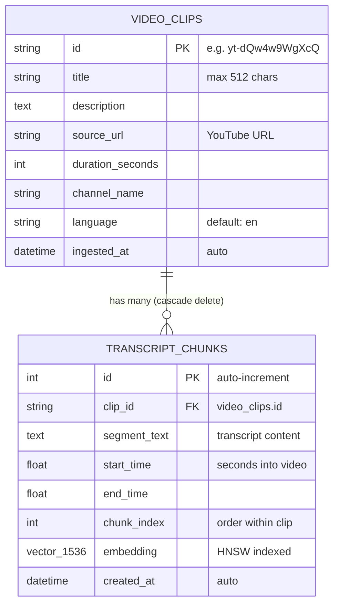
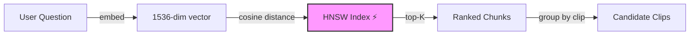
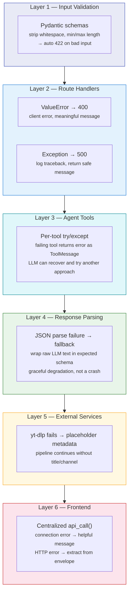

<div align="center">

# Semantic Video Search Engine

**Ask natural-language questions about your video library. Get timestamped, cited answers.**

[](https://github.com/singhrobin123/semantic-video-search/actions)
[](https://www.python.org/downloads/)
[](#testing)
[](LICENSE)

</div>

<br/>

<div align="center">

| Ingest a YouTube video | Ask a question | Get timestamped citations |
|:---:|:---:|:---:|
| Paste URL → auto-extract transcript → chunk → embed → store | LangGraph agent autonomously searches your library | Answer + exact quotes with seek-to-moment timestamps |

</div>

<br/>

> **How is this different from a basic RAG demo?**
> The LLM agent controls its own execution flow. It decides which tools to call, in what order, and when to stop — using a cyclic state machine, not a linear chain. It can examine multiple clips, skip irrelevant ones, and backtrack when needed.

---

## Table of Contents

- [System Architecture](#system-architecture)
- [How It Works](#how-it-works)
  - [Agentic Search](#1-agentic-search)
  - [Ingestion Pipeline](#2-ingestion-pipeline)
  - [Request Lifecycle](#3-request-lifecycle)
- [Data Model](#data-model)
- [Error Handling](#error-handling)
- [Quick Start](#quick-start)
- [API Reference](#api-reference)
- [Project Structure](#project-structure)
- [Testing](#testing)
- [Configuration](#configuration)
- [Technical Decisions](#technical-decisions)

---

## System Architecture



---

## How It Works

### 1. Agentic Search

When you ask a question, the LangGraph agent runs a **cyclic loop** — reason → call tool → observe → repeat until done.



**What makes this different from basic RAG:**

- The agent **chose** to examine only one clip. With multiple relevant clips, it would loop back and examine each one.
- The **clip cache** between steps 2 and 3 eliminates a redundant DB round-trip.
- A **hard cap of 8 iterations** prevents runaway loops and unbounded LLM cost.
- If the LLM returns **malformed JSON**, the respond node wraps raw text in the expected schema instead of crashing.

---

### 2. Ingestion Pipeline

Four independent stages, each testable in isolation:





**Design choices:**
- **Idempotent** — Same URL twice → updates metadata, replaces chunks, no duplicates
- **Graceful** — yt-dlp metadata is optional; pipeline continues with placeholder title if it fails
- **Batched** — Embeddings processed in groups of 512 to stay within rate limits

---

### 3. Request Lifecycle

Every request passes through the same middleware stack regardless of endpoint:



Every log line within a request carries the same `request_id`. You can grep for it to trace an entire search — agent tool calls, DB queries, LLM invocations — in one shot.

---

## Data Model



### Vector Search



| Parameter | Value | Notes |
|-----------|-------|-------|
| Embedding model | `text-embedding-3-small` | 1536 dimensions |
| Index type | HNSW | Hierarchical Navigable Small World graph |
| `m` | 16 | Connections per node |
| `ef_construction` | 64 | Build-time search depth |
| Distance | `vector_cosine_ops` | pgvector `<=>` operator |

HNSW gives sub-millisecond approximate nearest neighbor queries at millions of vectors, trading a small amount of recall for massive speed gains over exact search.

---

## Error Handling

Six layers, each with a specific strategy. No raw tracebacks ever reach the client.



<details>
<summary><strong>Code examples for each layer</strong></summary>

**Layer 1 — Pydantic strips whitespace before checking min_length:**
```python
class SearchRequest(BaseModel):
    query: str = Field(..., min_length=1, max_length=2000)

    @field_validator("query", mode="before")
    def strip_query(cls, v):
        return v.strip() if isinstance(v, str) else v
```

**Layer 2 — Route handler classifies errors:**
```python
try:
    result = await business_logic()
    return APIEnvelope(success=True, data=result)
except ValueError as exc:
    return JSONResponse(status_code=400,
        content=APIEnvelope(success=False, error=str(exc)).model_dump())
except Exception:
    logger.exception("operation_failed")
    return JSONResponse(status_code=500,
        content=APIEnvelope(success=False, error="Internal error").model_dump())
```

**Layer 3 — Each agent tool is individually wrapped:**
```python
try:
    result_str = await handler(**fn_args)
except Exception as exc:
    logger.exception("tool_execution_error", tool=fn_name)
    result_str = json.dumps({"error": str(exc)})
```

**Layer 4 — Bad LLM JSON gets wrapped in expected schema:**
```python
try:
    parsed = json.loads(content)
    response = SearchResponse(**parsed)
except (json.JSONDecodeError, Exception):
    result = {"results": [{"answer": content[:600], ...}]}
```

**Layer 5 — Metadata extraction is optional:**
```python
except ImportError:
    return {"title": f"YouTube Video {video_id}", ...}
```

**Layer 6 — Frontend handles disconnections:**
```python
except requests.exceptions.ConnectionError:
    st.error("Cannot reach backend. Is FastAPI running on port 8000?")
```

</details>

---

## Quick Start

### Prerequisites

- **Docker** — for PostgreSQL + pgvector
- **Python 3.12+**
- **OpenAI API Key** — [get one here](https://platform.openai.com/api-keys)

### Option A: Full Docker Stack

```bash
git clone git@github.com:singhrobin123/semantic-video-search.git
cd semantic-video-search
cp .env.example .env
# Set your OPENAI_API_KEY in .env

make up   # Builds and starts pgvector + backend + frontend
```

Open **http://localhost:8501**

### Option B: Local Development

```bash
git clone git@github.com:singhrobin123/semantic-video-search.git
cd semantic-video-search
cp .env.example .env
# Set your OPENAI_API_KEY in .env

# 1. Database
make db                         # Starts pgvector in Docker

# 2. Backend
cd backend
python3 -m venv .venv
source .venv/bin/activate
pip install -r requirements.txt
python -m app.db.seed           # Seeds 3 demo clips (28 chunks, ~$0.001)
uvicorn app.main:app --reload --port 8000

# 3. Frontend (new terminal)
cd frontend
pip install streamlit requests
streamlit run app.py --server.port 8501
```

### Verify

```bash
# Health
curl http://localhost:8000/health

# Library
curl -s http://localhost:8000/api/v1/library | python3 -m json.tool

# Search
curl -s -X POST http://localhost:8000/api/v1/search \
  -H "Content-Type: application/json" \
  -d '{"query": "How did they handle database scaling?"}' | python3 -m json.tool
```

---

## API Reference

Every endpoint returns a consistent **APIEnvelope**:

```json
{"success": true, "data": {...}, "error": null}
```

### Endpoints

| Method | Path | Description |
|--------|------|-------------|
| `POST` | `/api/v1/search` | Agentic semantic search |
| `POST` | `/api/v1/ingest/youtube` | Ingest a YouTube video |
| `POST` | `/api/v1/ingest/manual` | Ingest a manual transcript |
| `GET` | `/api/v1/library` | List all clips with chunk counts |
| `DELETE` | `/api/v1/library/{clip_id}` | Delete a clip (cascade) |
| `GET` | `/health` | Liveness probe |

### POST /api/v1/search

<details>
<summary>Request / Response</summary>

**Request:**
```json
{"query": "How did they handle database scaling?"}
```

**Response (200):**
```json
{
  "success": true,
  "data": {
    "results": [{
      "clip_id": "demo-incident-review",
      "question": "How did they handle database scaling?",
      "answer": "The fix was three-fold: increase pool size to 20, add connection timeouts, and implement read replicas.",
      "relevant_quotes": [
        {
          "quote": "The root cause was connection pool exhaustion.",
          "quote_description": "Root cause identification",
          "quote_timestamp": 30.0
        },
        {
          "quote": "The fix was three-fold: increase pool size to 20...",
          "quote_description": "Resolution steps",
          "quote_timestamp": 80.0
        }
      ],
      "related_questions": [
        "What monitoring was added after the incident?",
        "How do read replicas improve search performance?"
      ]
    }]
  },
  "error": null
}
```

**Errors:** `422` invalid input · `500` agent failure
</details>

### POST /api/v1/ingest/youtube

<details>
<summary>Request / Response</summary>

**Request:**
```json
{"url": "https://youtube.com/watch?v=aircAruvnKk", "languages": ["en"]}
```

**Response (200):**
```json
{
  "success": true,
  "data": {
    "clip_id": "yt-aircAruvnKk",
    "title": "But what is a neural network?",
    "chunks_stored": 47,
    "source_url": "https://www.youtube.com/watch?v=aircAruvnKk"
  }
}
```

**Errors:** `400` invalid URL / no transcript · `500` embedding failure
</details>

### POST /api/v1/ingest/manual

<details>
<summary>Request / Response</summary>

**Request:**
```json
{
  "clip_id": "meeting-2024-q4",
  "title": "Q4 Planning Meeting",
  "transcript": [
    {"text": "Welcome to Q4 planning.", "start": 0, "duration": 5},
    {"text": "Let's review our OKRs.", "start": 5, "duration": 3}
  ]
}
```
</details>

### GET /api/v1/library

<details>
<summary>Response</summary>

```json
{
  "success": true,
  "data": {
    "clips": [{
      "id": "yt-aircAruvnKk",
      "title": "But what is a neural network?",
      "source_url": "https://www.youtube.com/watch?v=aircAruvnKk",
      "duration_seconds": 1140,
      "channel_name": "3Blue1Brown",
      "language": "en",
      "chunk_count": 47
    }]
  }
}
```
</details>

### DELETE /api/v1/library/{clip_id}

```bash
curl -X DELETE http://localhost:8000/api/v1/library/yt-aircAruvnKk
# → {"success": true, "data": {"deleted": "yt-aircAruvnKk"}, "error": null}
```

**Errors:** `404` clip not found · `500` database error

---

## Project Structure

```
semantic-video-search/
│
├── backend/
│   ├── app/
│   │   ├── config.py              # Pydantic Settings — validated env vars
│   │   ├── main.py                # FastAPI app, lifespan, CORS, middleware
│   │   ├── agent/
│   │   │   ├── state.py           # TypedDict for graph state
│   │   │   ├── graph.py           # Cyclic agent graph
│   │   │   └── tools.py           # 3 retrieval tools + clip cache
│   │   ├── api/
│   │   │   ├── routes.py          # All endpoints
│   │   │   ├── schemas.py         # Pydantic models with validators
│   │   │   └── middleware.py      # X-Request-ID + latency tracking
│   │   ├── db/
│   │   │   ├── models.py          # VideoClip, TranscriptChunk ORM
│   │   │   ├── repository.py      # All SQL in one file
│   │   │   ├── session.py         # Async engine + connection pool
│   │   │   └── seed.py            # Demo data (3 clips, 28 chunks)
│   │   ├── ingestion/
│   │   │   ├── pipeline.py        # URL → transcript → chunks → vectors → DB
│   │   │   ├── transcriber.py     # YouTube transcript extraction
│   │   │   ├── chunker.py         # Sliding window with overlap
│   │   │   └── embedder.py        # Batch OpenAI embedding
│   │   ├── llm/
│   │   │   └── provider.py        # OpenAI + Anthropic switching
│   │   └── observability/
│   │       └── logging.py         # structlog config
│   ├── tests/
│   │   ├── unit/                  # 32 tests (no real APIs)
│   │   └── integration/           # 4 tests (full HTTP stack)
│   ├── Dockerfile
│   └── requirements.txt
│
├── frontend/
│   ├── app.py                     # Streamlit UI
│   └── Dockerfile
│
├── docs/adr/                      # Architecture Decision Records
├── docker-compose.yml             # pgvector + backend + frontend
├── Makefile                       # Developer commands
├── .github/workflows/ci.yml       # CI with pgvector service
└── .env.example                   # Config template
```

---

## Testing

```bash
make test              # All 36 tests
make test-unit         # 32 unit tests (no DB, no API keys)
make test-integration  # 4 integration tests
make test-cov          # Coverage report
```

| File | Tests | What It Covers |
|------|:-----:|----------------|
| `test_tools.py` | 6 | Tool dispatch, DB mocking, clip cache |
| `test_agent_graph.py` | 6 | Routing, respond node, iteration cap |
| `test_chunker.py` | 7 | Boundaries, overlap, timestamps, edge cases |
| `test_transcriber.py` | 6 | URL parsing (full, short, bare ID, invalid) |
| `test_api_schemas.py` | 7 | Validation, whitespace strip, envelope shape |
| `test_api_routes.py` | 4 | Full HTTP round-trip via httpx |

All external calls (OpenAI, DB) are mocked in unit tests — they run in under 1 second with zero cost. CI uses a real pgvector container via GitHub Actions services.

---

## Configuration

Copy `.env.example` to `.env`. All values are validated by Pydantic at startup.

| Variable | Default | Description |
|----------|---------|-------------|
| `OPENAI_API_KEY` | *(required)* | OpenAI API key |
| `ANTHROPIC_API_KEY` | *(optional)* | For Anthropic provider |
| `LLM_PROVIDER` | `openai` | `openai` or `anthropic` |
| `LLM_MODEL` | `gpt-4o-mini` | Chat model name |
| `LLM_TEMPERATURE` | `0.1` | Low = factual |
| `EMBEDDING_MODEL` | `text-embedding-3-small` | Embedding model |
| `DATABASE_URL` | `postgresql+asyncpg://...` | Async PG connection |
| `DB_POOL_SIZE` | `10` | Connection pool |
| `VECTOR_SEARCH_TOP_K` | `20` | KNN candidates |
| `HNSW_M` | `16` | Index connectivity |
| `HNSW_EF_CONSTRUCTION` | `64` | Index build quality |
| `APP_ENV` | `development` | `development` / `production` |
| `APP_LOG_LEVEL` | `INFO` | Log verbosity |

---

## Technical Decisions

| Decision | Chose | Over | Why |
|----------|-------|------|-----|
| Agent framework | LangGraph cyclic graph | LangChain linear chain | Agent needs to loop, backtrack, skip tools |
| Vector store | pgvector + HNSW | ChromaDB / FAISS / Pinecone | ACID, HNSW indexing, metadata in same DB |
| LLM | Multi-provider (OpenAI + Anthropic) | Single provider | Vendor flexibility, cost optimization |
| Chunking | Sentence-aware sliding window | Fixed-size / recursive split | Preserves sentence boundaries + timestamps |
| Embedding | text-embedding-3-small | ada-002 | 5x cheaper, comparable quality |
| DB access | Repository pattern | Direct ORM in routes | Swap vector backend by editing one file |
| Logging | structlog (JSON / console) | stdlib logging | Request ID correlation across call stack |

Full rationale documented in ADRs:

| ADR | Decision |
|-----|----------|
| [001](docs/adr/001-langgraph-over-langchain.md) | LangGraph over LangChain |
| [002](docs/adr/002-pgvector-over-chromadb.md) | pgvector over ChromaDB |
| [003](docs/adr/003-multi-provider-llm.md) | Multi-provider LLM abstraction |

---

## Makefile

```bash
make help         make install       make dev
make db           make seed          make up
make down         make clean         make test
make test-unit    make test-cov      make lint
```

---

## Tech Stack

| | Technology |
|-|-----------|
| Agent | LangGraph StateGraph |
| LLM | GPT-4o-mini / Claude |
| Embeddings | text-embedding-3-small |
| Vector DB | PostgreSQL + pgvector |
| Backend | FastAPI (async) |
| ORM | SQLAlchemy 2.0 (async) |
| Frontend | Streamlit |
| Ingestion | youtube-transcript-api + yt-dlp |
| Logging | structlog |
| Testing | pytest-asyncio + httpx |
| CI | GitHub Actions |
| Deploy | Docker Compose |

---

## License

MIT
